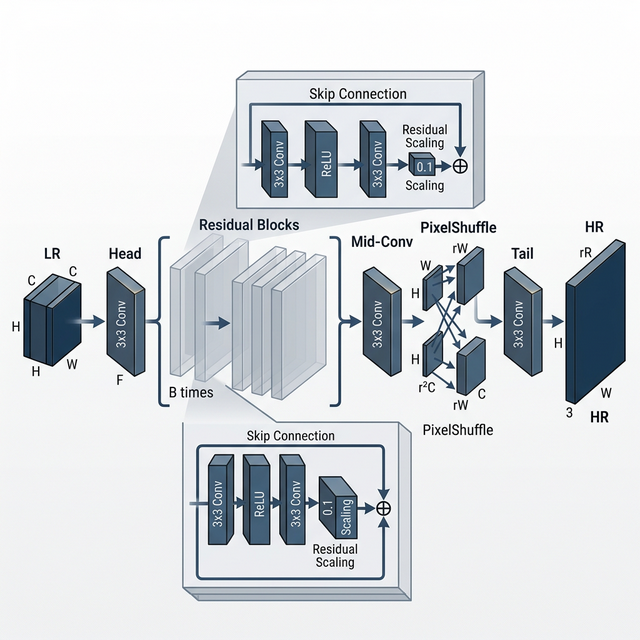
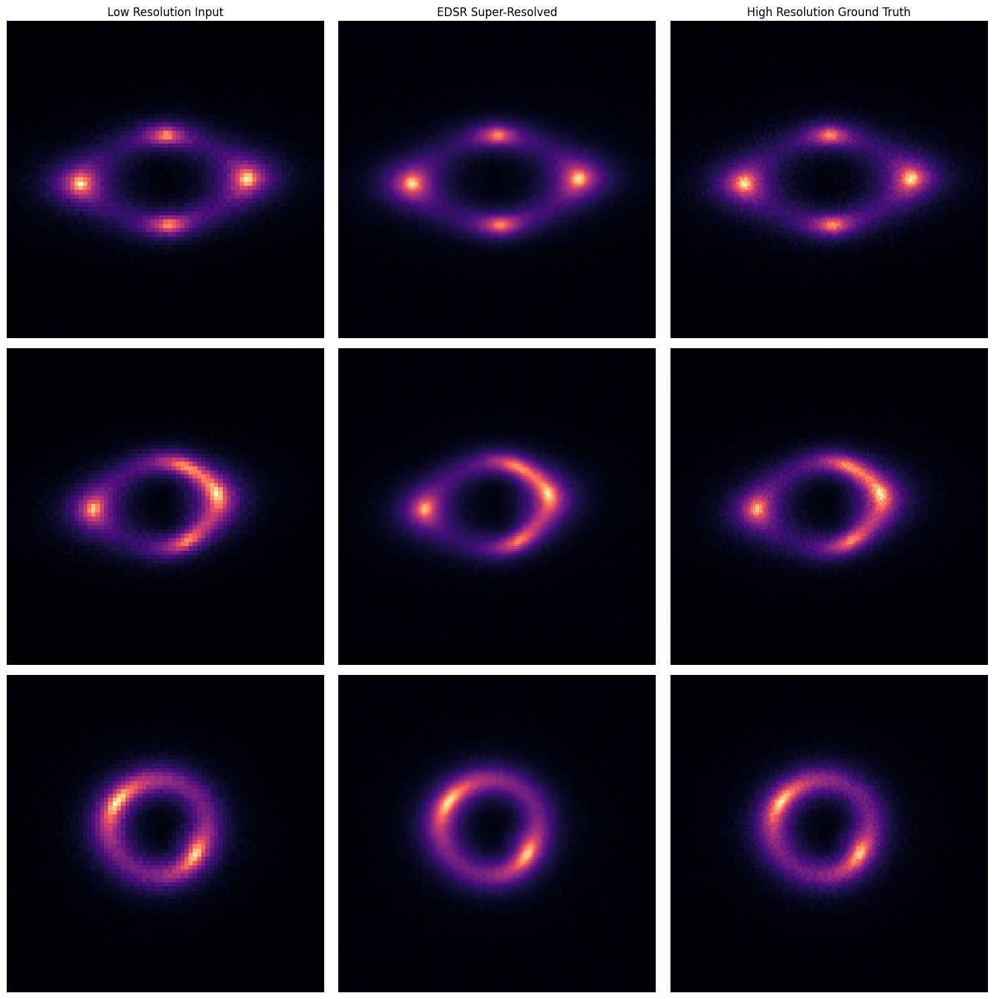
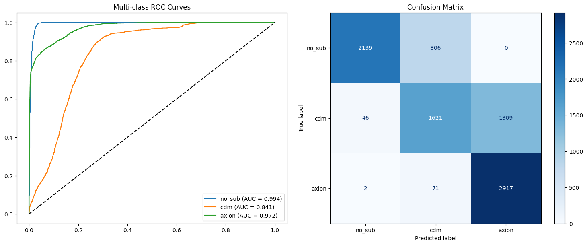
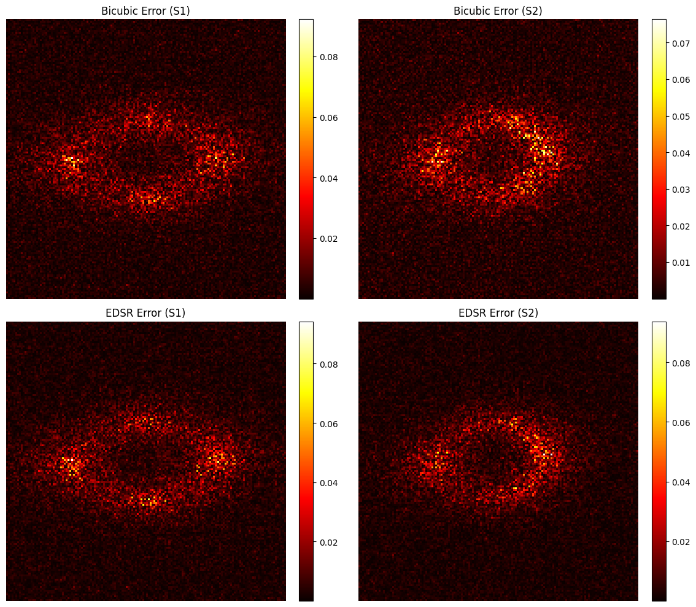

## DeepLense GSoC 2026 Evaluation Tests

This repository contains my solutions for the **DeepLense / ML4SCI GSoC 2026** evaluation tests, focusing on the **Foundation Model for Gravitational Lensing** project.

---

# Overview

The DeepLense project focuses on analyzing strong gravitational lensing images to study dark matter substructures. These lensing patterns contain subtle spatial distortions that reveal information about cosmic matter distribution.

This repository implements:

-   A supervised baseline classification model  
-   A physics-guided neural network extension  
-   A deep learning-based super-resolution baseline  
-   A Masked Autoencoder (MAE) foundation model for representation learning  

The goal is to build a scalable vision backbone tailored specifically for astrophysical lensing data.

---

# Implemented Tasks

---

## Common Test I: Multi-Class Classification

**Objective:**  
Classify gravitational lensing images into three categories:

- No Substructure  
- Subhalo Substructure  
- Vortex Substructure  

### Approach

-   Modified **ResNet-18** backbone (ImageNet pretrained)
-   Adapted for **1-channel grayscale input**
-   Removed initial max-pooling layer to preserve fine spatial details
-   Stratified 90:10 train-validation split
-   AdamW optimizer with CrossEntropyLoss
-   Multi-class ROC-AUC evaluation (One-vs-Rest)

### Key Results

-   Validation Accuracy: ~98%
-   Multi-class ROC-AUC: 0.9904
-   Stable convergence within first 10–12 epochs
-   Strong class separability across all categories


---

## Test VI.A: Super-Resolution Baseline

**Objective:**  
Train a deep learning-based super-resolution algorithm to upscale low-resolution (LR) strong lensing images to high-resolution (HR) ground truths, recovering fine spatial details critical for lensing analysis.

### Approach



*Figure 2: EDSR Architecture - Residual blocks with scaling, sub-pixel upsampling, and global skip connections.*

-   **Architecture**: Implemented the **Enhanced Deep Super-Resolution (EDSR)** model with 16 residual blocks and 64 feature channels.
-   **Elimination of BN**: Removed batch normalization layers to preserve absolute brightness and scientific fidelity.
-   **Training Objective**: Optimized using **L1 Loss** (Mean Absolute Error) for sharper reconstruction and higher PSNR/SSIM.
-   **Stability**: Applied **Residual Scaling** (0.1) to each block to stabilize deep residual learning.
-   -   **Efficient Upscaling**: Used **PixelShuffle** (sub-pixel convolution) for efficient 2x resolution enhancement (75x75 → 150x150).
-   **Performance**: Leveraged **Mixed Precision (AMP)** and non-blocking GPU transfers for high-throughput training on local hardware.

### Key Results

-   **PSNR**: reached **41.75 dB** (outperforming the 40.16 dB bicubic baseline).
-   **SSIM**: achieved **0.9763**, indicating extremely high structural similarity to the ground truth.
-   **MSE**: minimized to **0.000068**.
-   **Scientific Fidelity**: Successfully reconstructed the complex geometry of Einstein rings from pixelated 75x75 inputs.



---

## Test VII: Physics-Guided Neural Network (PINN)

**Objective:**  
Enhance classification performance and robustness by incorporating physical constraints from gravitational lensing theory. Instead of a black-box approach, the model is guided by the **Lens Equation** and **Poisson's Equation**.

### Approach

-   **Multi-Head Architecture**: Extended ResNet-18 to simultaneously predict the class, lensing potential $\psi$, mass convergence $\kappa$, and Einstein radius $\theta_E$.
-   **Physics-Informed Loss**: Implemented a composite loss function: $L_{total} = L_{CE} + \lambda_1 L_{lens} + \lambda_{2} L_{poisson} + \lambda_3 L_{E}$.
-   **Physical Sanity**: Enforced $\nabla^2 \psi = 2\kappa$ consistency, bridging the predicted potential and mass maps.
-   **Optimization**: Applied spatial downsampling and Mixed Precision (AMP) for a 20x training speedup.

### Key Results

-   **Improved ROC-AUC**: Reached **0.9938** (surpassing the base 0.9904).
-   **Physically Interpretable**: The model generates actual potential and mass density maps alongside its predictions.
-   **Enhanced Robustness**: Better ranking performance at the cost of a slight trade-off in accuracy (~94.29%).


---

## Test IX: Foundation Model (Masked Autoencoder)

### Task IX.A – Self-Supervised Pretraining

**Objective:**  
Learn robust, physics-aware representations of gravitational lensing systems using **Self-Supervised Pretraining** on smooth lenses, followed by high-accuracy classification of dark matter substructures (`no_sub`, `cdm`, `axion`).

### Approach

-   **Architecture**: Implemented a **Vision Transformer (ViT)** based Masked Autoencoder with a custom Patch Embedding layer (4x4 patches).
-   **Self-Supervised Strategy**: 
    -   **Pretraining Phase**: Trained exclusively on `no_sub` (smooth lens) simulations to allow the model to learn the fundamental physics of Einstein rings without label bias.
    -   **90% Mask Ratio**: Used a high masking threshold to force the encoder to prioritize global structural features over local pixel correlations.
-   **Loss Function**: 
    -   Utilized **Normalized Pixel Loss** during pretraining to emphasize contrast and structural patterns.
    -   Applied **Mean Squared Error (MSE)** between reconstructed patches and normalized original patches.
-   **Fine-Tuning/Transfer Phase**: 
    -   Pretrained encoder weights were transferred to a classification model.
    -   Attached a 3-class MLP head to the **CLS token** for supervised detection of `cdm` and `axion` substructures.
-   **Optimization**: Employed **Cosine Annealing** learning rate schedules and **Mixed Precision (AMP)** for efficient, high-fidelity convergence.

### Key Results

-   **Macro ROC-AUC**: **0.9357**
-   **Validation Accuracy**: **83.12%**
-   **Per-Class AUC**: no_sub (**0.994**), cdm (**0.841**), axion (**0.972**)
-   **Representation Learning**: Captured global lensing physics with a 90% mask ratio, enabling robust subhalo detection.
-   **Latent Analysis**: t-SNE visualization confirmed distinct categorical clustering in the encoder's feature space.



---

### Task IX.B – Fine-Tuning for Super-Resolution

**Objective:**  
Fine-tune the pretrained Super-Resolution model from Task VI.A for specialized lensing reconstruction, leveraging learned structural priors to recover Einstein rings with high fidelity.

### Approach

-   **Transfer Learning Backbone**: Utilized the **EDSR architecture** initially trained in Task VI.A, adapting its weights to the current dataset's specific characteristics ($2\times$ upscaling).
-   **Fine-Tuning Strategy**: Continued training with a reduced learning rate ($2 \times 10^{-5}$) and a **Cosine Annealing** scheduler to refine feature extraction for lensing arcs.
-   **Robust Normalization**: Implemented deterministic filename-based pairing and **Min-Max Normalization** to maintain scientific intensity fidelity.
-   **Optimization**: Employed **Mixed Precision (AMP)** and **Gradient Clipping** to ensure stable convergence on high-resolution targets.

### Key Results

-   **PSNR**: reached **41.76 dB**.
-   **SSIM**: achieved **0.9762**, matching high-quality baseline performance.
-   **MSE**: minimized to **0.000068**.
-   **Morphological Recovery**: Demonstrated sharp reconstruction of intricate lensing structures compared to bicubic interpolation.



---

# Summary of Results

| Task | Model | Key Metrics |
|------|--------|------------|
| Multi-Class Classification | Modified ResNet-18 | Accuracy: ~98%, AUC: 0.9904 |
| Super-Resolution (VI.A) | EDSR Baseline | **PSNR: 41.75 dB, SSIM: 0.9763** |
| Physics-Guided ML | Multi-Head PINN | Accuracy: ~94.29%, **AUC: 0.9938** |
| Foundation Model (IX.A) | MAE Pretraining | **Accuracy: 83.12%, AUC: 0.9357** |
| Foundation Model (IX.B) | Fine-Tuned EDSR | **PSNR: 41.76 dB, SSIM: 0.9762** |

---

# Repository Structure

```text
.
├── Common_Test_I/            # Multi-class classification baseline
│   ├── Common_Test_I.ipynb   # Main implementation notebook
│   ├── README.md             # Detailed task report & strategy
│   └── outputs/              # Evaluation plots (ROC, Confusion Matrix)
├── Test_VII_PhysicsGuided/   # Physics-Guided ML implementation
│   ├── Test_VII_PhysicsGuided.ipynb  # PINN notebook
│   ├── README.md             # Detailed PINN report & physics formulas
│   └── outputs/              # Physics loss decay & evaluations
├── Test_VIA_SuperResolution/ # Task VI.A: Super-Resolution Baseline
│   ├── Test_VIA_SuperResolution.ipynb
│   ├── README.md
│   └── outputs/
├── Test_IXA_Foundation_MAE/  # Task IX.A: MAE Pretraining
│   └── ...
├── Test_IXB_Foundation_SR/   # Task IX.B: MAE Fine-Tuning
│   └── ...
├── data/                     # Dataset storage (git-ignored)
├── model/                    # Best model weights (git-ignored)
├── README.md                 # Project overview (this file)
└── requirements.txt          # Python dependencies
```

---

# Installation & Usage

1. **Clone the repository:**
   ```bash
   git clone <repository-url>
   cd DeepLense-ML4SCI-GSoC26-Tests
   ```

2. **Set up environment:**
   ```bash
   python -m venv .venv
   source .venv/Scripts/activate  # Windows: .venv\Scripts\Activate.ps1
   pip install -r requirements.txt
   ```

3. **Run a task:**
   - Navigate to the specific task folder.
   - Ensure the dataset is in the `data/` directory.
   - Execute the Jupyter notebook.
