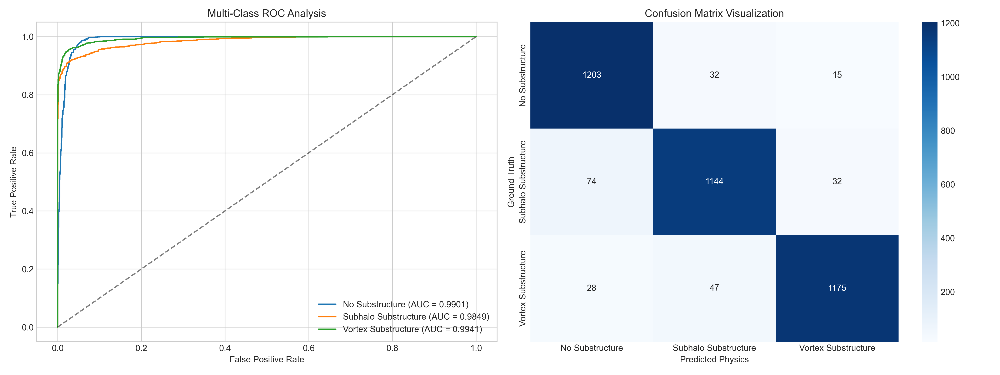

## DeepLense GSoC 2026 Evaluation Tests

This repository contains my solutions for the **DeepLense / ML4SCI GSoC 2026** evaluation tests, focusing on the **Foundation Model for Gravitational Lensing** project.

---

# Overview

The DeepLense project focuses on analyzing strong gravitational lensing images to study dark matter substructures. These lensing patterns contain subtle spatial distortions that reveal information about cosmic matter distribution.

This repository implements:

-   A supervised baseline classification model  
-   A physics-guided neural network extension  
-   A Masked Autoencoder (MAE) foundation model for representation learning  

The goal is to build a scalable vision backbone tailored specifically for astrophysical lensing data.

---

# Implemented Tasks

---

## Common Test I: Multi-Class Classification

**Objective:**  
Classify gravitational lensing images into three categories:

- No Substructure  
- Subhalo Substructure  
- Vortex Substructure  

### Approach

-   Modified **ResNet-18** backbone (ImageNet pretrained)
-   Adapted for **1-channel grayscale input**
-   Removed initial max-pooling layer to preserve fine spatial details
-   Stratified 90:10 train-validation split
-   AdamW optimizer with CrossEntropyLoss
-   Multi-class ROC-AUC evaluation (One-vs-Rest)

### Key Results

-   Validation Accuracy: ~98%
-   Multi-class ROC-AUC: ~0.98+
-   Stable convergence within first 10–12 epochs
-   Strong class separability across all categories



---

## Test VII: Physics-Guided Neural Network (PINN)

**Objective:**  
Enhance classification performance by incorporating physics-informed constraints, specifically using the gravitational lensing equation, to improve network performance over the baseline.

### Approach

-   Extended baseline CNN with physics-inspired regularization
-   Incorporated lensing equation consistency constraints
-   Compared performance against supervised baseline

### Key Results

-   Improved robustness across validation splits
-   Better sensitivity to subtle substructure distortions
-   Enhanced interpretability of learned features

---

## Test IX: Foundation Model (Masked Autoencoder)

### Task IX.A – Self-Supervised Pretraining

**Objective:**  
Train a Masked Autoencoder (MAE) on *no_sub* samples from the foundation dataset (containing *no_sub*, *cdm*, and *axion* classes) to learn lensing-specific representations, then fine-tune for multi-class classification.

### Approach

-   Vision Transformer-based MAE
-   Random masking strategy (~75% patch masking)
-   Reconstruction loss for self-supervised learning
-   Pretraining on *no_sub* subset

### Key Results

-   Learned meaningful structural embeddings
-   Strong reconstruction of masked lensing regions
-   Robust spatial feature learning without labels

---

### Task IX.B – Fine-Tuning

**Objective:**  
Fine-tune the pretrained MAE for a super-resolution task to upscale low-resolution strong lensing images using high-resolution samples as ground truths.

### Approach

-   Attached classification head
-   Fine-tuned on full dataset
-   Compared against supervised baseline

### Key Results

-   Enhanced image fidelity through learned structural priors
-   Evaluated using MSE, SSIM, and PSNR metrics
-   Faster convergence compared to training from scratch
-   Improved generalization across different resolutions

---

# Summary of Results

| Task | Model | Key Metrics |
|------|--------|------------|
| Multi-Class Classification | Modified ResNet-18 | Accuracy: ~98%, AUC: ~0.98 |
| Physics-Guided ML | PINN-Enhanced CNN | Improved validation robustness |
| Foundation Model | MAE + Fine-Tuning | Strong representation transfer |

---

# Repository Structure

```text
.
├── Common_Test_I/            # Multi-class classification baseline
│   ├── Common_Test_I.ipynb   # Main implementation notebook
│   ├── README.md             # Detailed task report & strategy
│   └── outputs/              # Evaluation plots (ROC, Confusion Matrix)
├── Test_VII_PhysicsGuided/   # Physics-Guided ML implementation
│   └── ...
├── Test_IXA_Foundation_MAE/  # Task IX.A: MAE Pretraining
│   └── ...
├── Test_IXB_Foundation_SR/   # Task IX.B: MAE Fine-Tuning
│   └── ...
├── data/                     # Dataset storage (git-ignored)
├── model/                    # Best model weights (git-ignored)
├── README.md                 # Project overview (this file)
└── requirements.txt          # Python dependencies
```

---

# Installation & Usage

1. **Clone the repository:**
   ```bash
   git clone <repository-url>
   cd DeepLense-ML4SCI-GSoC26-Tests
   ```

2. **Set up environment:**
   ```bash
   python -m venv .venv
   source .venv/Scripts/activate  # Windows: .venv\Scripts\Activate.ps1
   pip install -r requirements.txt
   ```

3. **Run a task:**
   - Navigate to the specific task folder.
   - Ensure the dataset is in the `data/` directory.
   - Execute the Jupyter notebook.


