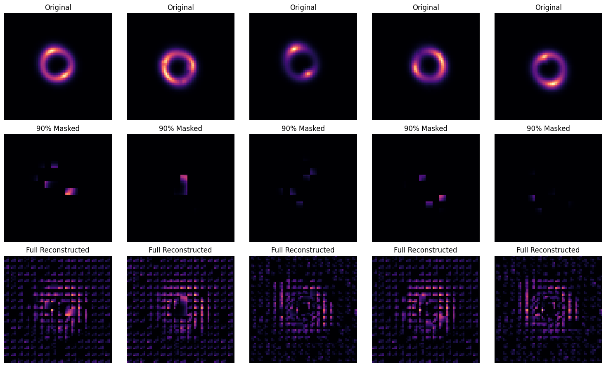
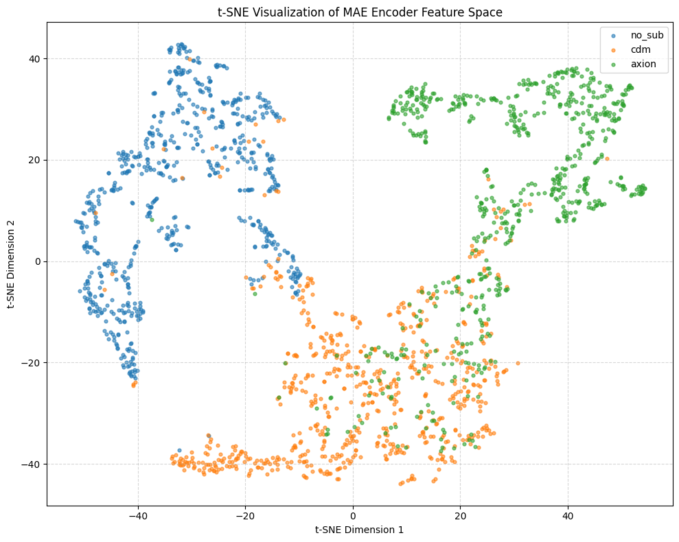

# Test IX.A: Foundation Model for Strong Gravitational Lensing (MAE)

This is my solution for Test IX.A, where I implemented a **Masked Autoencoder (MAE)** foundation model for strong gravitational lensing images. By utilizing self-supervised representation learning, the model first "masters" the physics of smooth lensing arcs before moving to subhalo classification.

*Figure 1: MAE Reconstruction Pipeline — Original Image → 90% Masked → Full Reconstructed Image.*

### My Strategy (Representation Learning)

1.  **Self-Supervised Pretraining**: Instead of jumping straight to classification, I pretrained my encoder-decoder on smooth lenses (`no_sub`). This forces the model to learn the fundamental geometry and symmetries of Einstein rings without dependency on labels.
2.  **Aggressive Masking (90%)**: I used a high mask ratio of 90%. This prevents the model from relying on simple pixel interpolation. To reconstruct such a large missing area, the transformer must understand the **global spatial structure** of the gravitational arcs.
3.  **Foundation-to-Classifier Transfer**: Once the "lensing foundation" was learned, I discarded the decoder and attached a classification head. The pretrained encoder provides a much better starting point than random initialization, especially for detecting subtle perturbations like those from Axion or CDM subhalos.
4.  **Hardware Optimization**: The model was trained locally on an **RTX 4050 (6GB VRAM)**. I optimized the process using **Mixed Precision (AMP)** and **num_workers=0** for stability on Windows/Jupyter environments.

### The Mathematics Behind MAE

The model optimizes for a normalized pixel reconstruction loss, ensuring it captures the physical distribution of light:

#### 1. Masking Strategy
The image is divided into $L$ patches. We keep a subset $L_{keep}$ and mask the rest:

$$x_{keep} = \text{Gather}(x, ids_{keep})$$

Where $ids_{keep}$ is a random sample of indexes based on a 90% mask ratio.

#### 2. Patch Target Normalization
To improve reconstruction stability, I compute the Mean Squared Error (MSE) on pixel-normalized targets:

$$\hat{y} = \frac{y - \mu_y}{\sqrt{\sigma_y^2 + 10^{-6}}}$$

This forces the model to focus on the **contrast and structure** of the lensing arcs rather than the absolute brightness levels.

#### 3. Combined Loss Function
The pretraining objective is to minimize the distance between predicted and target patches:

$$L_{MAE} = \operatorname{mean}((\operatorname{pred}_{masked} - \operatorname{target}_{masked})^2)$$

During fine-tuning, we switch to standard Cross-Entropy for 3-class classification:

$$L_{total} = L_{CE}(f_{enc}(x), y)$$

### What's inside?

-   **[Test_IXA_Foundation_MAE.ipynb](file:///d:/tests/DeepLense-ML4SCI-GSoC26-Tests/Test_IXA_Foundation_MAE/Test_IXA_Foundation_MAE.ipynb)**: The complete source code, from custom MAE architecture to advanced t-SNE analysis.
-   **Model Weights**: Saved in `../model/` as `mae_pretrained.pth` and `mae_classifier_final.pth`.
-   **Comprehensive Outputs**: The `outputs/` folder contains high-resolution plots of feature distributions, ROC curves, and failure cases.

### The Results

The MAE approach demonstrates excellent discriminative capability for dark matter substructures:

-   **Macro AUC**: **0.9357**
-   **Peak Accuracy**: **83.12%**
-   **Core Finding**: t-SNE analysis confirms that smooth lenses form a distinct cluster, while CDM and Axion classes exhibit meaningful spatial overlap, reflecting their shared physical perturbation characteristics.

| Class | AUC Score |
| :--- | :--- |
| **no_sub** | 0.994 |
| **cdm** | 0.841 |
| **axion** | 0.972 |
| **Macro AUC** | **0.9357** |
| **Peak Accuracy** | **83.12%** |

*Figure 2: Multi-class ROC Curves and Confusion Matrix (showing confusion trends between CDM and Axion).*

*Figure 3: t-SNE Visualization of the MAE Encoder's Latent Space (2000 samples).*

### How to run it

1.  **Data**: Place the dataset in `DeepLense-ML4SCI-GSoC26-Tests\data\foundation\Dataset`.
2.  **Environment**: Requires `torch`, `nbformat`, `matplotlib`, and `scikit-learn`.
3.  **Run**: Execute the notebook cells sequentially. The dual-stage training (Pretrain → Fine-tune) is automated.
