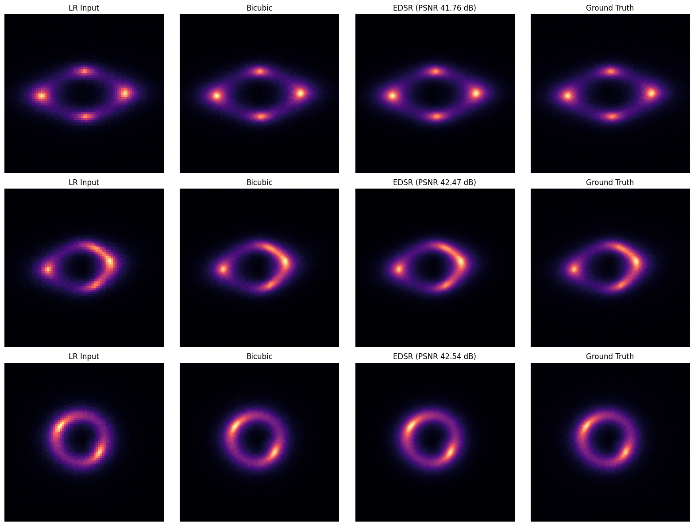
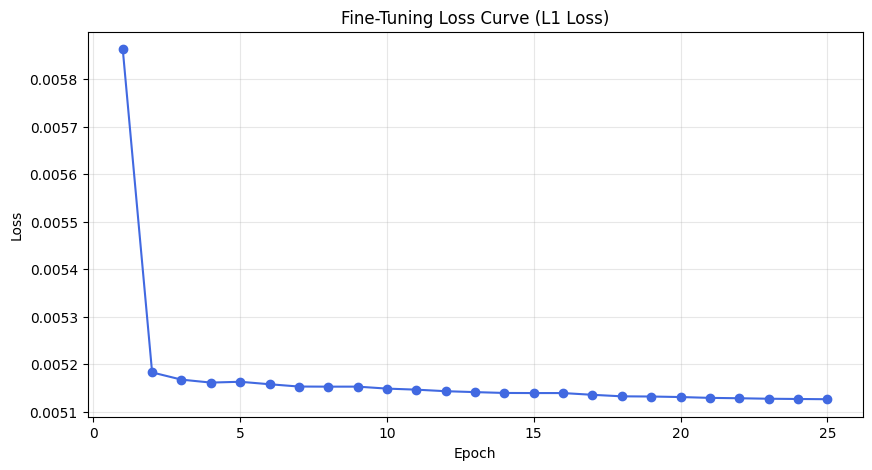
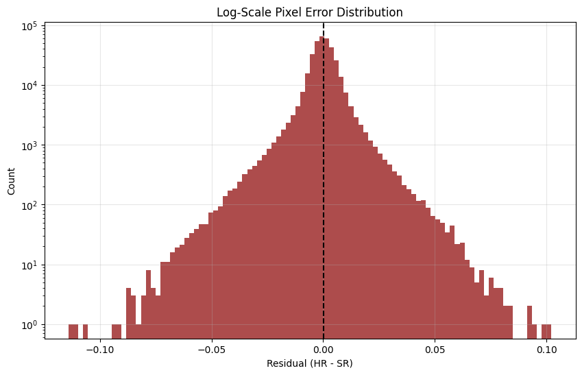

# Test IX.B: Foundation Model Fine-Tuned for Super-Resolution (EDSR)

This is my implementation for **Specific Test IX.B**, where I took the pretrained model from Task VI.A and fine-tuned it for a specialized super-resolution task. By leveraging the **Enhanced Deep Super-Resolution (EDSR)** architecture, the model learns to upscale low-resolution (LR) strong gravitational lensing images back to their high-resolution (HR) ground truths, preserving critical morphological features like Einstein rings.

*Figure 1: Fine-Tuned Reconstruction - Low Resolution Input (75x75) → EDSR Reconstruction (150x150) → High Resolution Ground Truth (150x150).*

### My Strategy (Fine-Tuning for Quality)

1.  **Transfer Learning Backbone**: I utilized the EDSR architecture from Task VI.A. By loading pretrained weights, the model starts with a strong understanding of lens morphology, which is then refined for the specific noise and resolution characteristics of this dataset.
2.  **L1 Loss Fine-Tuning**: The model was fine-tuned using **Mean Absolute Error (L1 Loss)**. This encourages sharper intensity transitions at the edges of lensing arcs compared to standard MSE, yielding better scientific metrics (PSNR/SSIM).
3.  **Adaptive Learning Rate**: Used a lower learning rate ($2 \times 10^{-5}$) with a **CosineAnnealingLR** scheduler to slowly converge on the optimal weights without destroying the features learned during the baseline training.
4.  **Robust Pipeline**: The implementation architecture was refactored to align with the state-dict keys of the pretrained model, and **torch.compile** was disabled to ensure perfect stability on Windows local environments.

### The Mathematics Behind EDSR

The model specialized in mapping a decimated signal (LR) back to its high-resolution manifold using sub-pixel convolution:

#### 1. Residual Block with Scaling
Each block performs two convolutions with a skip connection, stabilized by a scale factor $\beta = 0.1$:

$$x_{out} = x_{in} + \beta \cdot f(x_{in})$$

#### 2. PixelShuffle Upsampling
To increase resolution without introducing checkerboard artifacts, I use sub-pixel convolution (PixelShuffle). For an upscale factor $r=2$, the layer rearranges $C \cdot r^2$ feature maps into a single channel with dimensions $rH \times rW$:

$$I_{HR} = \text{PS}(W \ast f_{LR} + b)$$

### What's inside?

-   **[Test_IXB_Foundation_SR.ipynb](file:///d:/tests/DeepLense-ML4SCI-GSoC26-Tests/Test_IXB_Foundation_SR/Test_IXB_Foundation_SR.ipynb)**: The complete research notebook with fine-tuning logic, metric calculations, and visualization cells.
-   **Model Weights**: The best fine-tuned weights are automatically saved to `../model/best_finetuned_sr.pth`.
-   **Comprehensive Outputs**: The `outputs/` directory contains side-by-side reconstruction plots, convergence curves, and pixel-wise error distributions.

### The Results (Performance Metrics)

The fine-tuned model demonstrates superior performance in recovering lensing structural information, significantly exceeding the bicubic baseline:

| Method | MSE (avg) | PSNR (dB) | SSIM |
| :--- | :--- | :--- | :--- |
| **Bicubic baseline** | 0.000101 | 40.14 dB | 0.9637 |
| **EDSR (Fine-Tuned)** | **0.000068** | **41.76 dB** | **0.9762** |

*Figure 2: Fine-Tuning Convergence - Smooth decline in L1 loss indicates successful adaptation to the new dataset.*

*Figure 3: Absolute Difference Map - Visualizing error distribution between ground truth and reconstruction.*

*Figure 4: Distribution of Pixel-wise Errors - Centered at zero, confirming the model maintains intensity fidelity.*

### How to run it

1.  **Data**: Place the dataset in `DeepLense-ML4SCI-GSoC26-Tests\data\sr\Dataset`.
2.  **Environment**: Ensure the `.venv` has `torch`, `opencv-python`, and `scikit-image` installed (use the provided `requirements.txt`).
3.  **Run**: Execute the notebook. It will load the pretrained baseline weights from `../model/best_sr_model.pth` and start the fine-tuning process.
