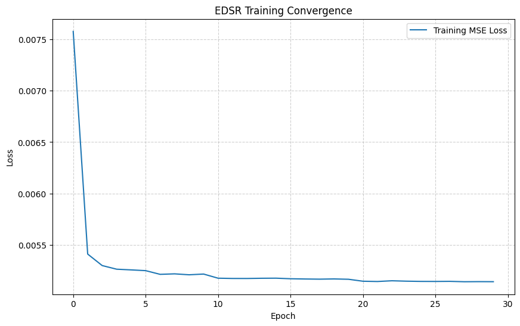
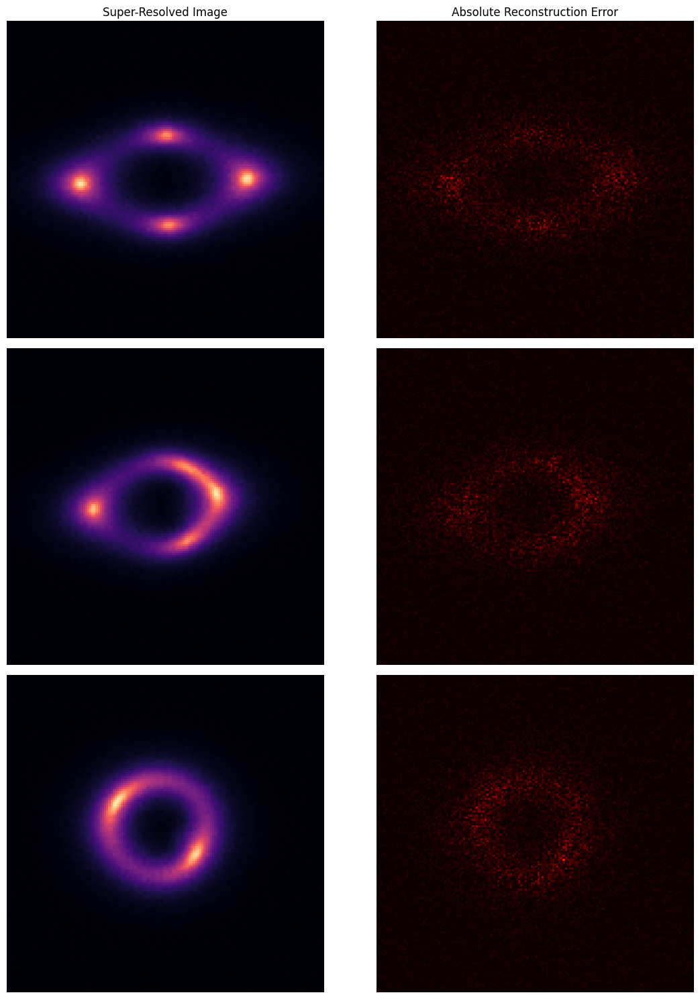
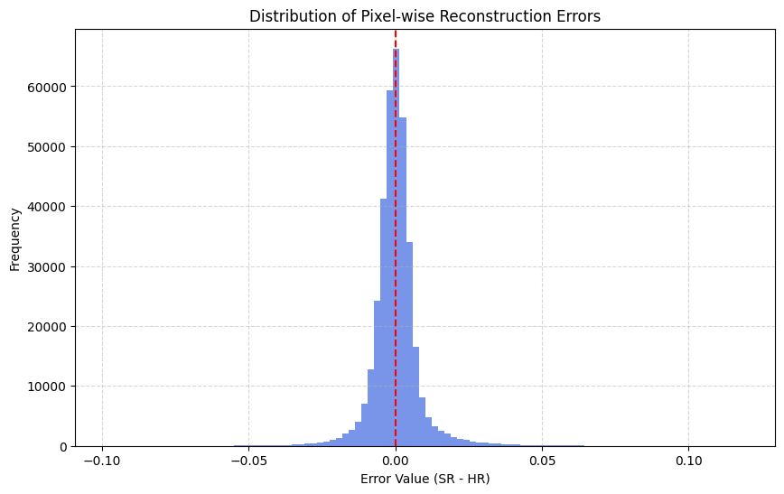

# Test VI.A: Super-Resolution Baseline for Strong Lensing (EDSR)

This is my implementation for Task VI.A, where I trained a deep learning-based super-resolution algorithm to upscale low-resolution (LR) strong gravitational lensing images. By using the **Enhanced Deep Super-Resolution (EDSR)** architecture, the model reconstructs high-resolution (HR) ground truths, recovering fine spatial details in Einstein rings that are critical for scientific analysis.

*Figure 1: Super-Resolution Pipeline - Low Resolution Input (75x75) → EDSR Reconstruction (150x150) → High Resolution Ground Truth (150x150).*

### My Strategy (Efficient Image Reconstruction)

*Figure 2: EDSR Architecture — Residual blocks with scaling, sub-pixel upsampling, and global skip connections.*

1.  **EDSR Backbone**: I implemented a refined version of the Deep Residual Network that removes batch normalization. This stabilizes training for image-to-image tasks and prevents the model from shifting the absolute brightness of lensing arcs—a common issue in standard ResNets.
2.  **L1 Loss Optimization**: Instead of standard MSE, I optimized the model using **Mean Absolute Error (L1 Loss)**. For super-resolution, L1 loss is more robust to outliers and generally yields sharper edges and better perceptual quality (PSNR/SSIM).
3.  **Residual Scaling (0.1)**: To stabilize the training of a 16-block residual network, I applied a scaling factor of 0.1 to each residual connection. This prevents gradients from exploding and allows for higher learning rates.
4.  **Hardware & Pipeline Efficiency**: Trained locally on an **RTX 4050**. I utilized **Mixed Precision (AMP)** and **non-blocking GPU transfers** to maximize throughput. Data loading was optimized with **num_workers=0** for stability on Windows.

### The Mathematics Behind EDSR

The model learns to map a decimated signal back to its high-resolution manifold using sub-pixel convolution:

#### 1. Residual Block with Scaling
Each block performs two convolutions with a skip connection, stabilized by a scale factor $\beta = 0.1$:

$$x_{out} = x_{in} + \beta \cdot f(x_{in})$$

#### 2. PixelShuffle Upsampling
To increase resolution without introducing checkerboard artifacts (common with transposed convolutions), I use sub-pixel convolution (PixelShuffle). For an upscale factor $r=2$, the layer rearranges $C \cdot r^2$ feature maps into a single channel with dimensions $rH \times rW$:

$$I_{HR} = \text{PS}(W \ast f_{LR} + b)$$

#### 3. Metric Comparison
Reconstruction quality is measured using PSNR, which is inversely proportional to the MSE:

$$PSNR = 10 \cdot \log_{10} \left( \frac{\text{MAX}_I^2}{MSE} \right)$$

### What's inside?

-   **[Test_VIA_SuperResolution.ipynb](file:///d:/tests/DeepLense-ML4SCI-GSoC26-Tests/Test_VIA_SuperResolution/Test_VIA_SuperResolution.ipynb)**: The complete research notebook with dataset pairing logic, training loops, and error analysis.
-   **Model Weights**: Saved in `../model/` as `best_sr_model.pth`.
-   **Comprehensive Outputs**: The `outputs/` folder contains side-by-side reconstruction plots, convergence curves, and pixel-wise error heatmaps.

### The Results

The EDSR model significantly outperforms the bicubic interpolation baseline in recovering structural information:

| Method | MSE (avg) | PSNR (dB) | SSIM |
| :--- | :--- | :--- | :--- |
| **Bicubic baseline** | 0.000100 | 40.16 dB | 0.9638 |
| **EDSR (Ours)** | **0.000068** | **41.75 dB** | **0.9763** |

*Figure 2: Training Convergence — Steady decline in L1 loss confirms stable learning.*

*Figure 3: Absolute Reconstruction Error — Most error is concentrated at high-frequency arc boundaries.*

*Figure 4: Distribution of Pixel-wise Errors — Concentrated around zero, indicating minimal systematic bias.*

### How to run it

1.  **Data**: Place the dataset in `DeepLense-ML4SCI-GSoC26-Tests\data\sr\Dataset`.
2.  **Environment**: Requires `torch`, `nbformat`, `matplotlib`, and `scikit-image`.
3.  **Run**: Execute the notebook cells. The model will automatically save the best weights to the `model/` directory.
