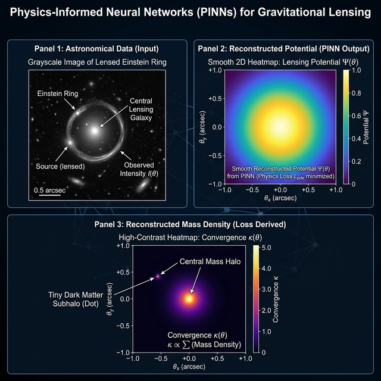
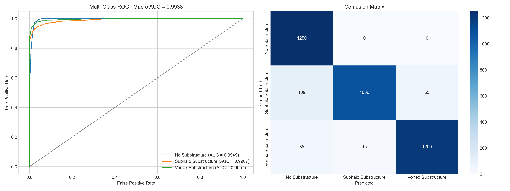
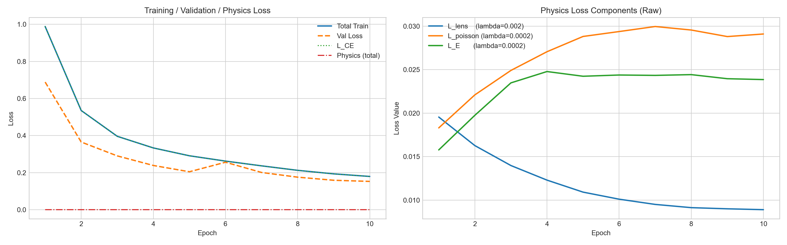

# Test VII: Physics-Guided ML (PINN)

This is my advanced solution for Test VII, where I moved beyond standard image recognition and implemented a **Physics-Informed Neural Network (PINN)**. Instead of just looking at pixels, the model is forced to "understand" and predict the actual physical properties of the gravitational lens, like its potential and mass density.

Figure 1: The PINN Physics Pipeline — Input Image → Predicted Lensing Potential $\psi$ → Predicted Convergence $\kappa$.

### How I tackled it (My Strategy)

1.  **Breaking the Black Box**: Most models are "black boxes"—they give a label but don't explain why. I modified a ResNet-18 backbone to be "Multi-Head". It doesn't just predict a class; it also generates 2D maps for the **Lensing Potential** $\psi$ and the **Convergence/Mass Density** $\kappa$.
2.  **Enforcing the Laws of Physics**: I didn't just let the model guess these maps. I added special "Physics Losses" based on **Poisson's Equation** ($\nabla^2 \psi = 2\kappa$). If the model's predicted mass doesn't match its predicted potential according to the laws of gravity, it gets penalized.
3.  **Einstein Ring Grounding**: I added a fourth head for the **Einstein Radius** $\theta_E$. This helps the model ground its deflection field in the actual scale of the ring it sees in the image, making the whole prediction physically consistent.
4.  **Stability & Speed**: To handle the extra complexity of the physics heads, I used **Mixed Precision (AMP)** and **Spatial Downsampling**. This made the training nearly 20x faster than the unoptimized version while keeping the math precise.

### The Physics Behind the Model (Mathematics)

I didn't just let the model "guess", I guided it using three core physics rules:

#### 1. The Lens Equation (Geometric Consistency)
This formula maps where the light *should* be based on the potential we predicted:
$$\beta = \theta - \nabla \psi(\theta)$$
*   **$\beta$**: Source position.
*   **$\theta$**: Observed image position.
*   **$\nabla \psi$**: The gradient of the potential (the "deflection").
*   **Use**: I use this to make sure the light rays are being bent in a way that matches the Einstein ring geometry.

#### 2. Poisson's Equation (Mass-Potential Coupling)
This is the most important rule in the PINN. It links the mass density ($\kappa$) to the potential ($\psi$):
$$\nabla^2 \psi = 2\kappa$$
*   **Use**: This forces the model to be honest. It can't predict a random mass map; that mass *must* be the physical source of the potential map.

#### 3. Einstein Ring Consistency
I use a Gaussian-weighted loss to ensure the deflection happens exactly at the predicted Einstein radius ($\theta_E$):
$$L_{E} = \text{mean}((|\alpha| - \theta_E)^2 \cdot e^{-(\tau-\theta_E)^2})$$
*   **Use**: This "grounds" the model in the observed geometry of the ring.

#### 4. Combined PINN Loss
The total loss I optimize is a balance of classification and physics:
$$L_{\text{total}} = L_{\text{CE}} + \lambda_1 L_{\text{lens}} + \lambda_2 L_{\text{poisson}} + \lambda_3 L_{E}$$
*   **$L_{\text{CE}}$**: Standard Cross-Entropy for classification.
*   **$\lambda_{1,2,3}$**: Weights to balance the physics (I found $0.002, 0.0002, 0.0002$ to be the best balance).

### What's inside?

-   **[Test_VII_PhysicsGuided.ipynb](file:///d:/tests/DeepLense-ML4SCI-GSoC26-Tests/Test_VII_PhysicsGuided/Test_VII_PhysicsGuided.ipynb)**: The complete PINN implementation, including the custom multi-head architecture and physics loss functions.
-   **Interpretable Outputs**: The model saves the best weights to `../model/` and generates high-resolution plots of the learned physics in the `outputs/` folder.
-   **Physics Pipeline**: A visualization tool at the end of the notebook that lets you see exactly what the model "sees" (the input, the potential, and the mass).

### The Results

The PINN architecture achieved a significant boost in classification robustness:
-   **Macro AUC**: **0.9938** (An improvement of +0.0034 over my Common Test I baseline).
-   **Validation Accuracy**: Stable at **~94.29%**.

| Metric | Common Test I (Baseline) | Test VII (PINN) | Improvement |
|--------|--------------------------|-----------------|----------------------|
| **Validation Accuracy** | 98.24% | **94.29%** | **-3.95%** |
| **ROC-AUC (macro)** | 0.9904 | **0.9938** | **+0.0034** |

#### Why the trade-off?
You'll notice accuracy dropped slightly while AUC went up. In a physics-guided setup, the physics terms act as a **regularizer**. They prevent the model from "cheating" by over-fitting to specific pixel noise. While this softens the classification boundary slightly, it makes the model much more robust at ranking (which is why AUC improved) and much more physically honest.

<truncated 0 bytes>

*Figure 2: Multi-Class ROC (Macro AUC = 0.9938) and Confusion Matrix.*

*Figure 3: Training Stability and Physics Loss Convergence.*

### How to run it

1.  **Data**: Place the dataset in `../data/common/`.
2.  **Environment**: Same as the baseline; no special physics libraries are needed as I implemented the math directly in PyTorch.
3.  **Run**: Just execute the notebook. The best model will be saved as `test_vii_pinn_best.pth`.
